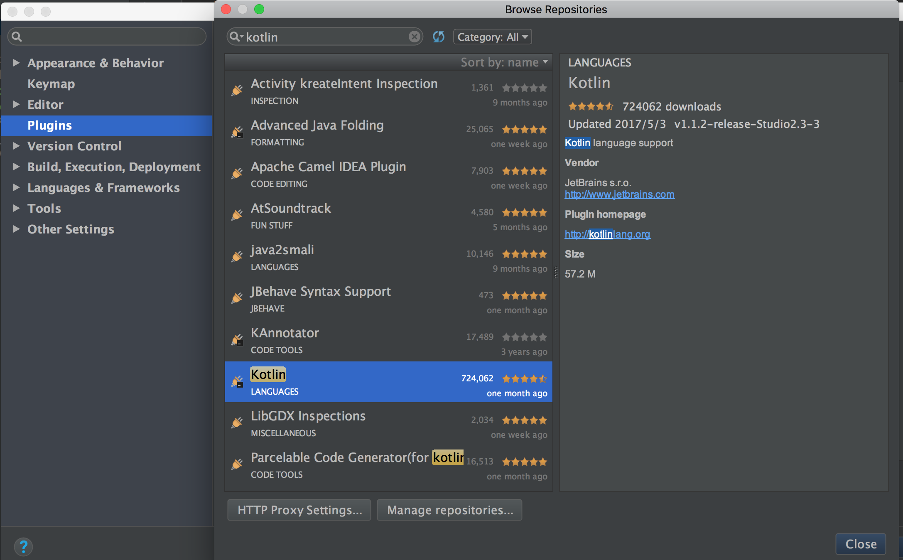
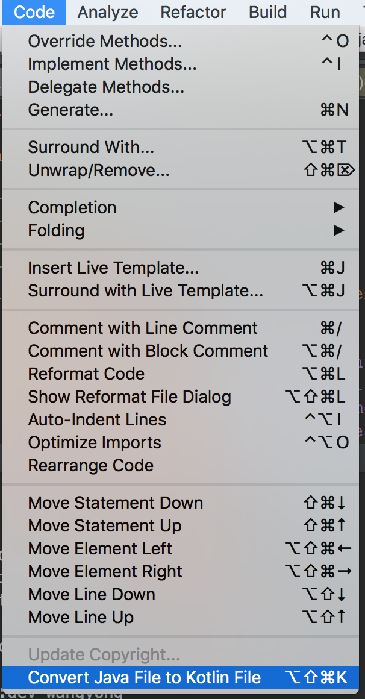

# KotlinStudio
Kotlin stuido demo
#### Kotlin学习第一弹,搭建kotlin环境

Google IO大会将Kotlin定位为Android开发第一语言,作为一个合格的Android程序猿,是时候学习一波来一波`kotlin`教程了:

1. AndroidStudio 3.0将内置对kotlin的支持,但是暂时还是个预览版,正式版需要等待几个月之后,鉴于大部分还是2.x版本,需要安装最新的`kotlin插件`
  
    打开AndroidStudio plugins,搜索`Kotlin`,安装插件即可(注:很多教程上需要装`Kotlin Android Extensions`,但是如今`kotlin`插件已经集成了`Kotlin Android Extensions`,只需要装一个`kotlin`即可)



2. 创建一个Androidstudio项目,选择空模板即可.
2. 在**项目的build.gradle**(Project gradle) 加上`kotlin`编译支持,写这篇博客时最新版本的`kotlin`为`1.1.2-3`,为了统一管理版本,我们定义`ext.kotlin_version = "1.1.2-3"`

最终如下:

```
buildscript {
    ext.kotlin_version = "1.1.2-3"
    repositories {
        jcenter()
    }
    dependencies {
        classpath 'com.android.tools.build:gradle:2.3.2'
        classpath "org.jetbrains.kotlin:kotlin-gradle-plugin:$kotlin_version"
        // NOTE: Do not place your application dependencies here; they belong
        // in the individual module build.gradle files
    }
}

allprojects {
    repositories {
        jcenter()
    }
}

task clean(type: Delete) {
    delete rootProject.buildDir
}
```
dependencies中加入了`classpath "org.jetbrains.kotlin:kotlin-gradle-plugin:$kotlin_version"`

3. 在**项目的build.gradle(Module)**加入`kotlin`支持

```
apply plugin: 'kotlin-android'
apply plugin: 'kotlin-android-extensions'
```
同时引入`kotlin`的jar包

```
compile "org.jetbrains.kotlin:kotlin-stdlib:$kotlin_version"
```
- 最终的项目完整的`build.gradle`如下

```
apply plugin: 'com.android.application'
apply plugin: 'kotlin-android'
apply plugin: 'kotlin-android-extensions'

buildscript {
    repositories {
        jcenter()
    }
}

android {
    compileSdkVersion 25
    buildToolsVersion "25.0.2"

    defaultConfig {
        applicationId "me.chunyu.spike.wcl_kotlin_demo"
        minSdkVersion 14
        targetSdkVersion 25
        versionCode 1
        versionName "1.0"
    }
    buildTypes {
        release {
            minifyEnabled false
            proguardFiles getDefaultProguardFile('proguard-android.txt'), 'proguard-rules.pro'
        }
    }
    sourceSets {
        main.java.srcDirs += 'src/main/kotlin'
    }
}

dependencies {
    compile fileTree(dir: 'libs', include: ['*.jar'])
    androidTestCompile('com.android.support.test.espresso:espresso-core:2.2.2', {
        exclude group: 'com.android.support', module: 'support-annotations'
    })
    compile 'com.android.support:appcompat-v7:25.1.1'
    compile 'com.android.support.constraint:constraint-layout:1.0.2'
    testCompile 'junit:junit:4.12'
    compile "org.jetbrains.kotlin:kotlin-stdlib:$kotlin_version"
}
```


3. 配置完成后,build一下项目,即可开始kotlin代码的编写,这回能好好的出去装X了

4. 将Java代码转换成kotlin代码

打开MainActivity,选择code -->convert java file to kotlin(可以顺便记一下快捷键),将Java代码转换成kotlin代码;



转换后如下:

```
class MainActivity : AppCompatActivity() {

    override fun onCreate(savedInstanceState: Bundle?) {
        super.onCreate(savedInstanceState)
        setContentView(R.layout.activity_main)
        tv.text="Hello kotlin"
        tv.textSize=20.0f
        tv.setTextColor(Color.BLACK)
    }
}
```
十分简洁,再也没有`findViewById`,再也没有`setText`等十分繁琐的代码,如果你之前学过`Python`,发现他们是如此的相像,语法相似度超过90%;

##### 示例代码 [GitHub  KotlinStudio](https://github.com/Mr-wangyong/KotlinStudio)

欢迎start,issue我的GitHub,

[FragmentStack](https://github.com/Mr-wangyong/FragmentStack)

- 便捷的利用fragment替代Activity创建页面,自带任务栈,返回栈;


[ImageFrame](https://github.com/Mr-wangyong/ImageFrame)

- 高效读取序列帧,序列帧动画必备,内存复用,千张图片只使用一张图片的内存;
